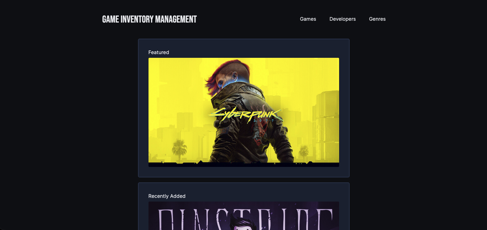
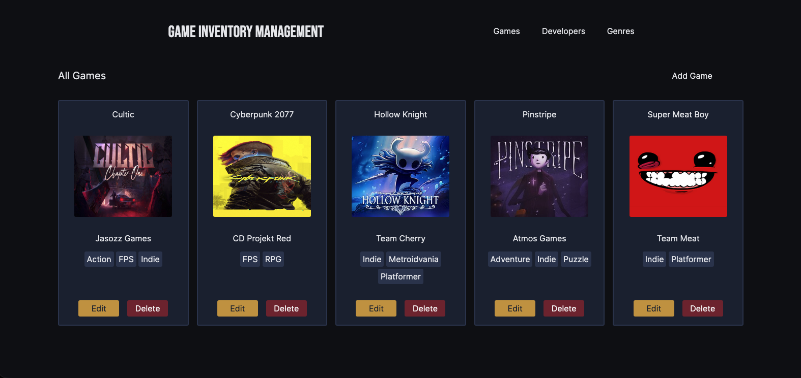
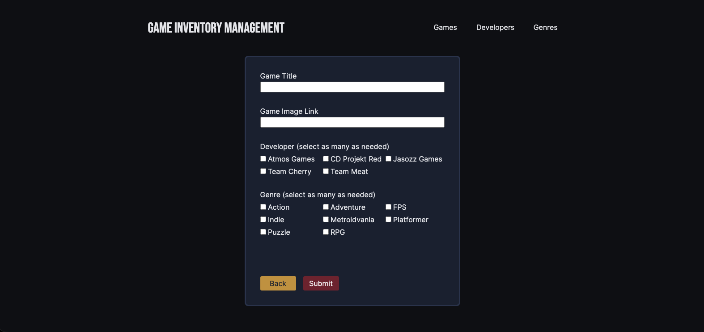

# 🕹️ Video Game Inventory Manager

A video game inventory management application built with Node.js, Express, PostgreSQL, and EJS. This project was created to deepen my understanding of the MVC architecture, relational database design, and writing raw SQL queries.

## 🚀 Live Deployment

https://inventory-application-qhrs.onrender.com/

## 👓 Overview

This application allows users to manage a video game inventory through a full CRUD interface. Games can be associated with multiple genres and developers, demonstrating many-to-many relationships within a PostgreSQL database.

## 👨‍💻 Technologies Used

- Node.js
- Express
- PostgreSQL
- EJS
- HTML
- CSS
- Javascript
- express-validator
- node-postgres

## ✨ Features

- Create, Read, Update, and Delete video games against the database
- Add multiple genres/developers to a game
- Add an image link for both the game and the developer
- Responsive Design

## 👨‍🎓 What I Learned

- Designing relational database schemas and implementing table relationships in PostgreSQL
- Writing raw SQL queries for CRUD operations and data retrieval
- Creating and deploying database seed scripts
- Structuring a server-side application using the MVC pattern
- Managing many-to-many relationships between games, genres, and developers

## 🛠️ Future Improvements

- User authentication and authorization
- Image uploads instead of URL-based images
- Search and filtering functionality
- Pagination for large inventories

## 📓 Notes

This project intentionally omits authentication and authorization. Any visitor can create, edit, or delete inventory records. User authentication and role-based access control are outside the scope of this project and will be explored in future projects.

## 📺 Screenshots

### Homepage

### All Games

### Add Game

